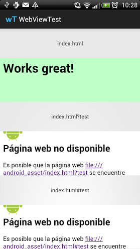

WebViewTest
===========

##Description

Small test app to try to solve a problem with a WebView. In some devices I've found a problem loading a local html file.

I was loading a index.html with a # parameter (index.html#{lang}), and with that test I want to try if the problem is the hash.

The device that could not load the page was a: HTC EVO 3D X515m with android 4.0.3. 

Screenshot of the app in a device that has the problem:

##Possible related links

- [Android webview error Page not found] (http://stackoverflow.com/q/14410725/2412686)
